# Section-1
# 1. Getting Started
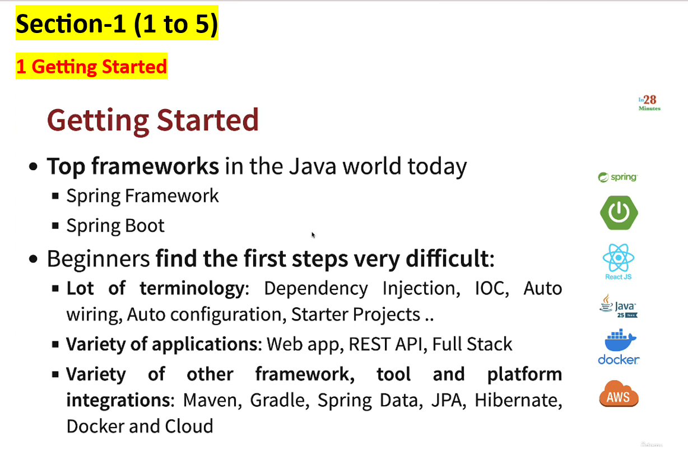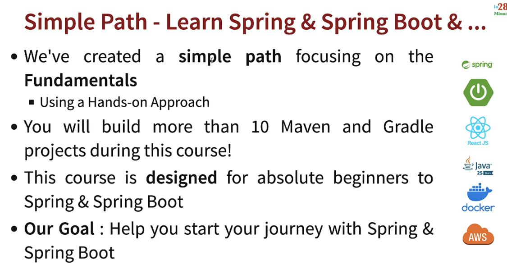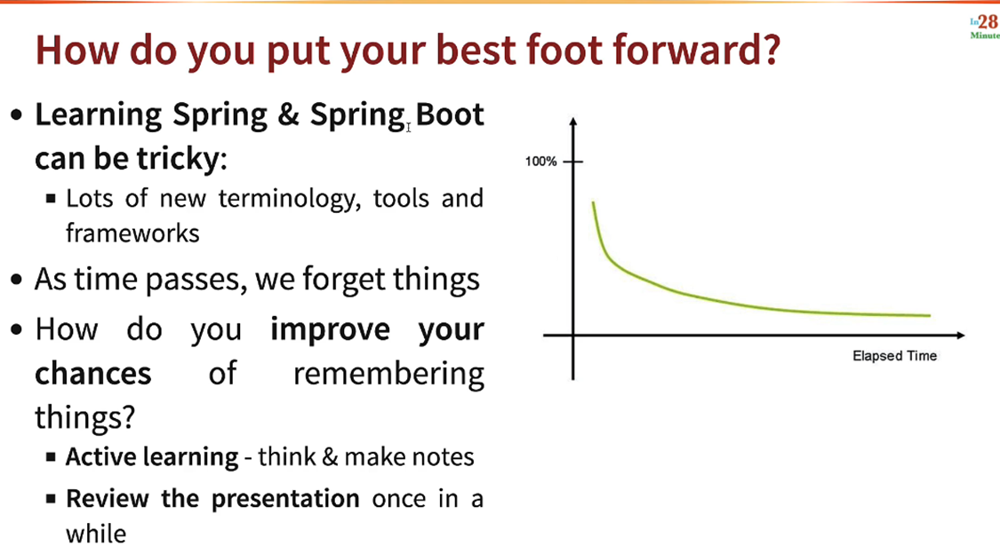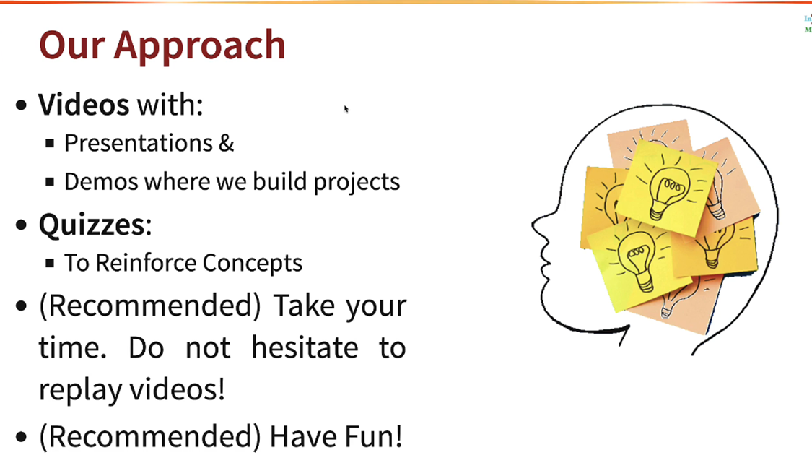
# 4. Installing java and Ide
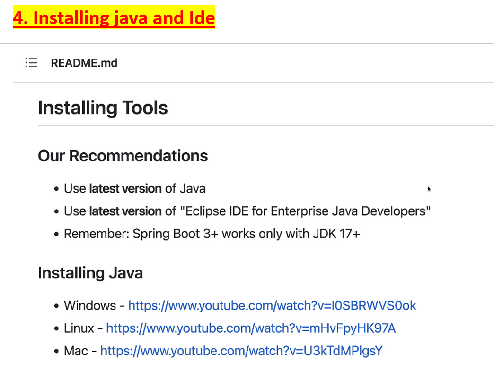
# Section-2 (6-10)
# 7. Understanding the need of Java Framework
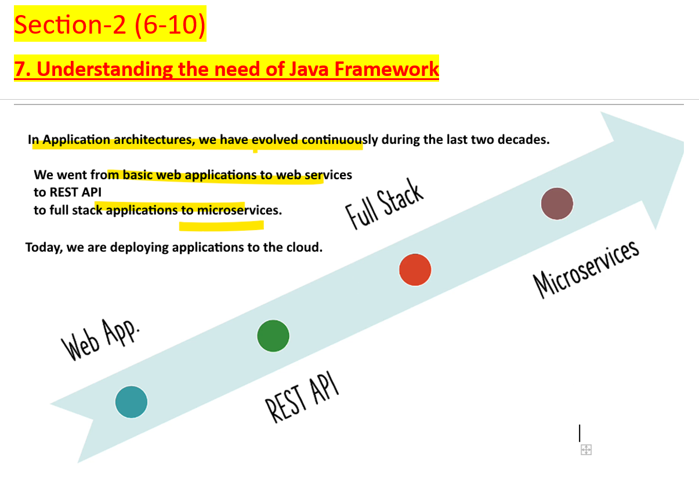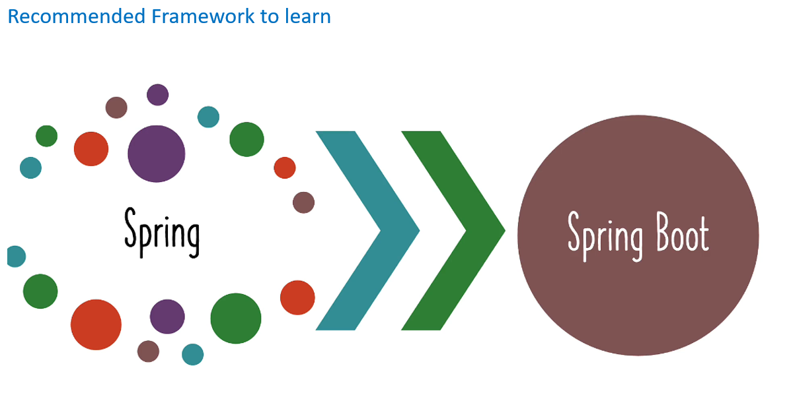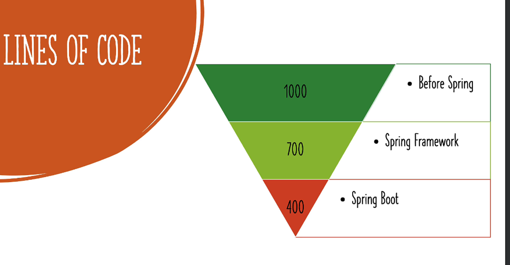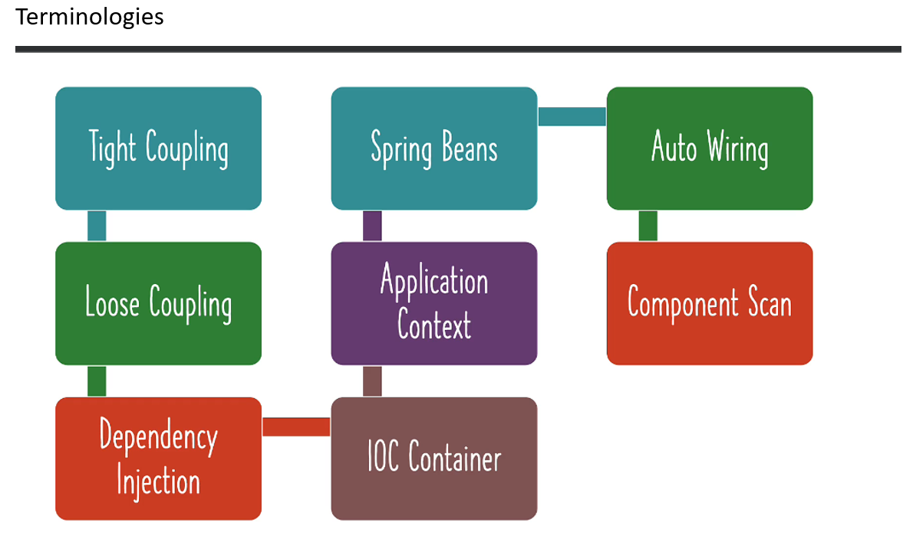
# 8. Getting Started.
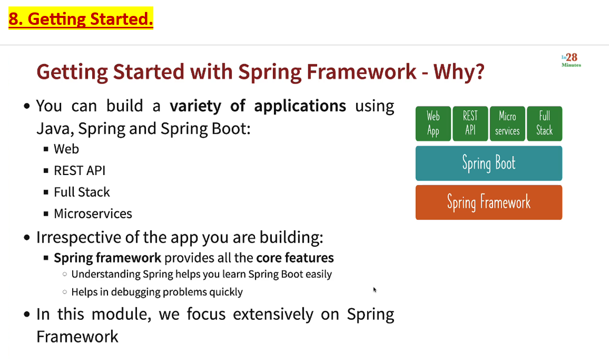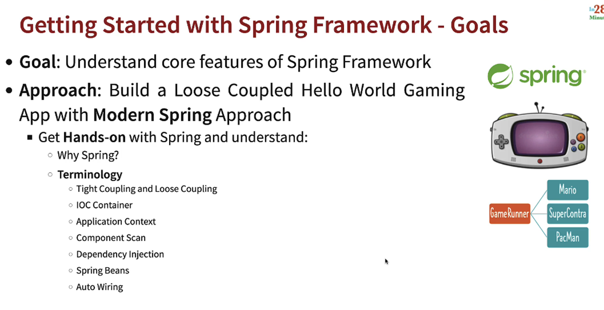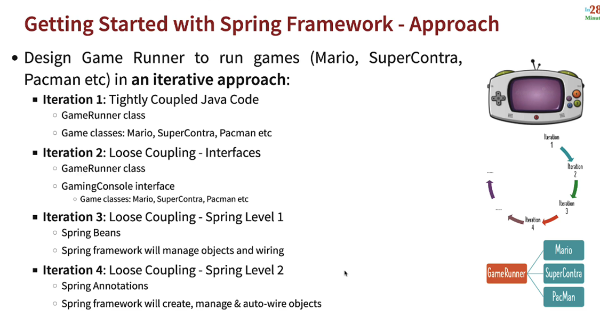
# 9. Step-3 Create new Spring Framework
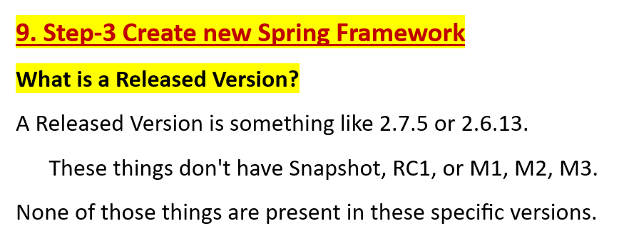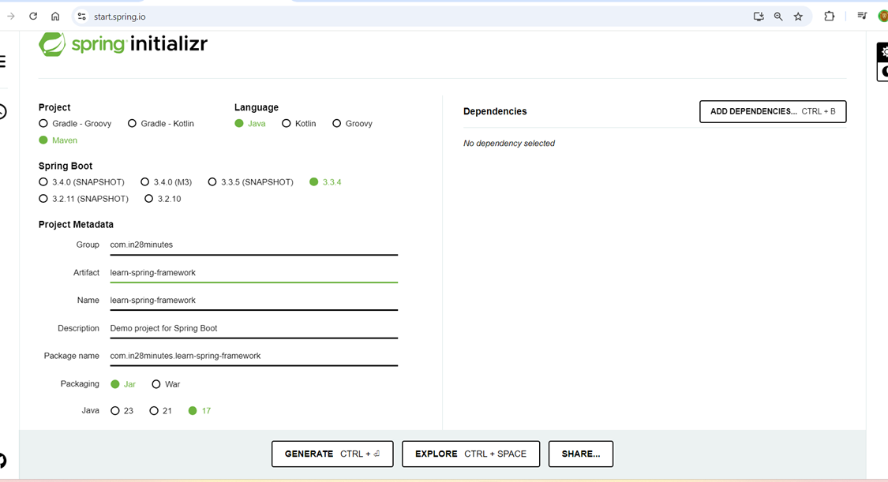
# 10. Intro to Spring Initializer and Maven
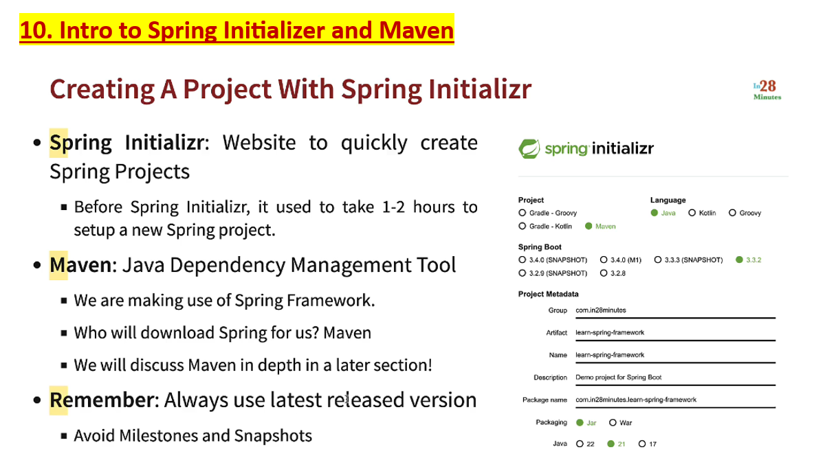
# 11. Quiz
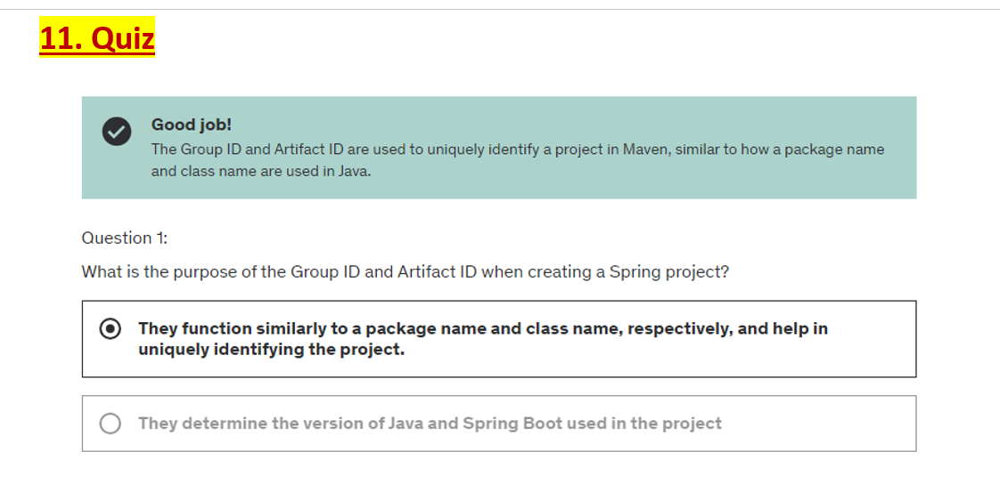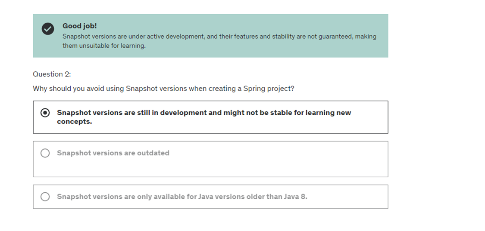
# Section-3 (11 to 14)
# 11. Step-4. Java Gaming Application
