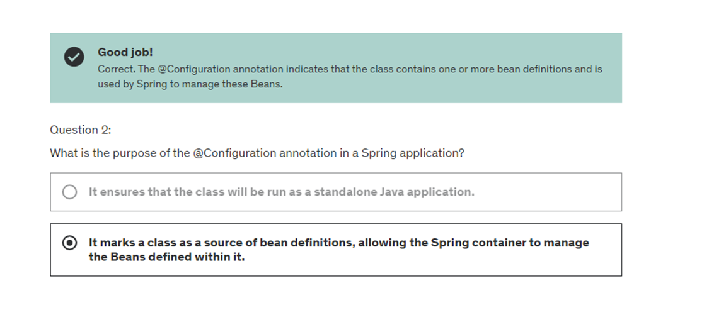
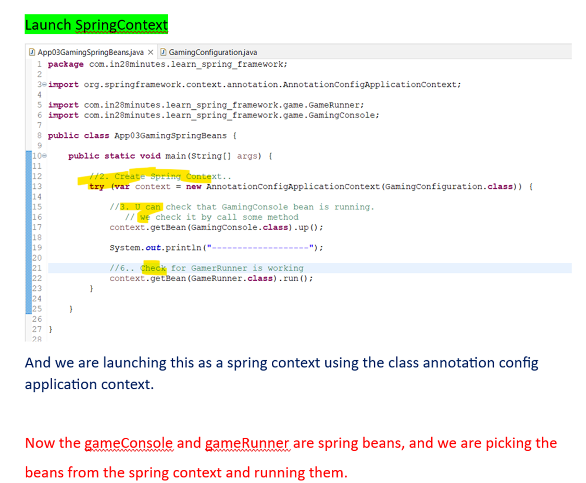
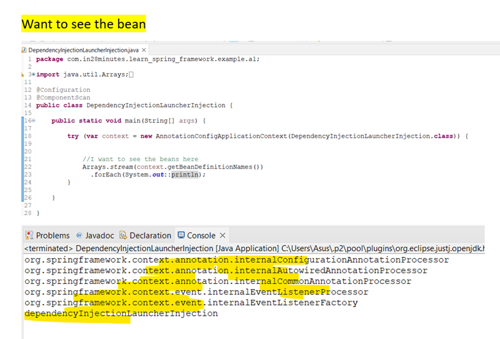
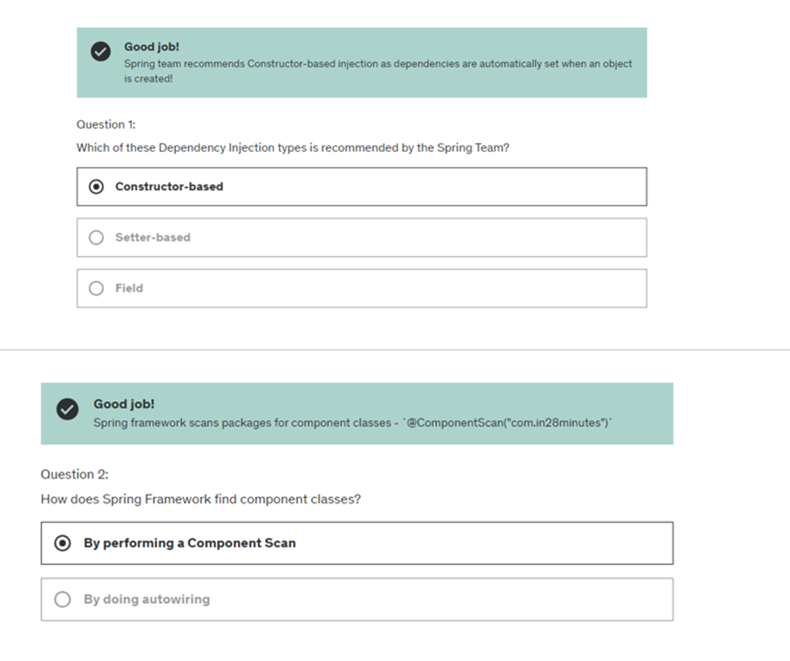

# Section-30 – Functional Pgm
# 416. Step-1 Functional Pgm

### FP01Structured.java
```java
package programming;

import java.util.List;

public class FP01Structured {

	public static void main(String[] args) {
		
		//Method to print All number in list
		printAllNumberInListStructured(List.of(12,9,13,4,6,2,4,12,15));
	}

	private static void printAllNumberInListStructured(List<Integer> numbers) {		
		
		for(int number : numbers) {
			System.out.println(number);
		}		
	}

}
```
# 417. Step-2

### FP01Functional.java
```java
package programming;

import java.util.List;

public class FP01Functional {

	public static void main(String[] args) {

		// Method to print All number in list
		printAllNumberInListFunctional(List.of(12, 9, 13, 4, 6, 2, 4, 12, 15));
	}

	private static void print(int number) {
		System.out.println(number);
	}

	private static void printAllNumberInListFunctional(List<Integer> numbers) {

		numbers.stream().forEach(FP01Functional::print);

	}

}
```
# 418. Step-3 via filter

### FP01Functional.java
```java
package programming;

import java.util.List;

public class FP01Functional {

	public static void main(String[] args) {

		// Method to print All number in list
		printAllNumberInListFunctional(List.of(12, 9, 13, 4, 6, 2, 4, 12, 15));
	}

	private static void printAllNumberInListFunctional(List<Integer> numbers) {

		numbers.stream().forEach(System.out::println);

	}

}
```
### FP01Structured.java
```java
package programming;

import java.util.List;

public class FP01Structured {

	public static void main(String[] args) {

		List<Integer> numbers = List.of(12, 9, 13, 4, 6, 2, 4, 12, 15);
//		printAllNumberInListStructured(numbers);
		printEvenNumberInListStructured(numbers);
	}

	private static void printAllNumberInListStructured(List<Integer> numbers) {

		for (int number : numbers) {
			System.out.println(number);
		}
	}

	private static void printEvenNumberInListStructured(List<Integer> numbers) {

		for (int number : numbers) {
			if (number % 2 == 0)
				System.out.println(number);
		}
	}

}
```
### FP01Functional.java
```java
package programming;

import java.util.List;

public class FP01Functional {

	public static void main(String[] args) {

		List<Integer> numbers = List.of(12, 9, 13, 4, 6, 2, 4, 12, 15);
//		printAllNumberInListFunctional(numbers);
		printEvenNumberInListFunctional(numbers);
	}

	private static boolean isEven(int number) {
		return number % 2 == 0;
	}

	private static void printAllNumberInListFunctional(List<Integer> numbers) {

		numbers.stream().forEach(System.out::println);
	}

	private static void printEvenNumberInListFunctional(List<Integer> numbers) {

		numbers.stream().filter(FP01Functional::isEven).forEach(System.out::println);
	}
}
```
# 419. Step-4 Using lambda

### FP01Functional.java
```java
package programming;

import java.util.List;

public class FP01Functional {

	public static void main(String[] args) {

		List<Integer> numbers = List.of(12, 9, 13, 4, 6, 2, 4, 12, 15);
		printEvenNumberInListFunctional(numbers);
	}

	private static void printEvenNumberInListFunctional(List<Integer> numbers) {

		numbers.stream().filter(number -> number % 2 == 0).forEach(System.out::println);
	}
}
```
# 420. Step-5

### FP01Exercises.java
```java
package programming;

import java.util.List;

public class FP01Exercises {

	public static void main(String[] args) {

		List<Integer> numbers = List.of(12, 9, 13, 4, 6, 2, 4, 12, 15);

		// Print odd number list
		printOddNumberInListFunctional(numbers);
	}

	private static void printOddNumberInListFunctional(List<Integer> numbers) {

		numbers.stream().filter(number -> number % 2 != 0).forEach(System.out::println);
	}
}
```
### FP01Exercises.java
```java
package programming;

import java.util.List;

public class FP01Exercises {

	public static void main(String[] args) {

		// Exercise-1
		List<Integer> numbers = List.of(12, 9, 13, 4, 6, 2, 4, 12, 15);
//		printOddNumberInListFunctional(numbers);

		List<String> courses = List.of("Spring", "Spring Boot", "API", "Microservices", "AWS", "PCF", "Azure", "Docker",
				"Kubernate");

		//// Exercise-3
		courses.stream().filter(course -> course.contains("Spring")).forEach(System.out::println);
	}

}
```
###  FP01Exercises.java
```java
package programming;

import java.util.List;

public class FP01Exercises {

	public static void main(String[] args) {	

		List<String> courses = List.of("Spring", "Spring Boot", "API", "Microservices",
				"AWS", "PCF", "Azure", "Docker",
				"Kubernate");

		courses.stream()
		 .filter(course -> course.length() >= 4)
		 .forEach(System.out::println);
	}

}
```
# 421. Step-6 Using map

### FP01Exercises.java
```java
package programming;

import java.util.List;

public class FP01Exercises {

	public static void main(String[] args) {	

		List<Integer> numbers = List.of(12, 9, 13, 4, 6, 2, 4, 12, 15);
		
		List<String> courses = List.of("Spring", "Spring Boot", "API", "Microservices",
				"AWS", "PCF", "Azure", "Docker",
				"Kubernate");

		printCubesOfOddNumber(numbers);
	}

	private static void printCubesOfOddNumber(List<Integer> numbers) {
		
		numbers.stream()
		 .filter(number -> number%2 != 0)
		 .map(number -> number * number * number)
		 .forEach(System.out::println);
		
	}	

}
```
### FP01Exercises.java
```java
package programming;

import java.util.List;

public class FP01Exercises {

	public static void main(String[] args) {	

		List<Integer> numbers = List.of(12, 9, 13, 4, 6, 2, 4, 12, 15);
		
		List<String> courses = List.of("Spring", "Spring Boot", "API", "Microservices",
				"AWS", "PCF", "Azure", "Docker",
				"Kubernate");

//		printCubesOfOddNumber(numbers);
		
		printLengthOfCourses(courses);
	}

	private static void printLengthOfCourses(List<String> courses) {
		
		courses.stream()
		 .map(course ->  (course + " : " +course.length()))
		 .forEach(System.out::println);
		
	}

	private static void printCubesOfOddNumber(List<Integer> numbers) {
		
		numbers.stream()
		 .filter(number -> number%2 != 0)
		 .map(number -> number * number * number)
		 .forEach(System.out::println);
		
	}	

}
```
# 422. Step-7 Optional

# Section-1
# 1. Getting Started

# 4. Installing java and Ide

# Section-2 (6-10)
# 7. Understanding the need of Java Framework

# 8. Getting Started.

# 9. Step-3 Create new Spring Framework

# 10. Intro to Spring Initializer and Maven

# 11. Quiz

# Section-3 (11 to 14)
# 11. Step-4. Java Gaming Application

### AppGamingBasicJava.java
```java
package com.in28minutes.learn_spring_framework;

import com.in28minutes.learn_spring_framework.game.GameRunner;
import com.in28minutes.learn_spring_framework.game.MarioGame;

public class AppGamingBasicJava {

	public static void main(String[] args) {
	
		var marioGame = new MarioGame();
		var gameRunner = new GameRunner(marioGame);	
		gameRunner.run();
	}
}
```
### MarioGame.java
```java
package com.in28minutes.learn_spring_framework.game;

public class MarioGame {

}
```
### GameRunner.java
```java
package com.in28minutes.learn_spring_framework.game;

public class GameRunner {

	MarioGame game;

	public GameRunner(MarioGame game) {
		this.game = game;
	}

	public void run() {		
		System.out.println("Running game: " + game);		
	}	
}
```
# 12. Step-4 Adding button to our Gaming App.

### MarioGame.java
```java
package com.in28minutes.learn_spring_framework.game;

public class MarioGame {

	public void up() {
		System.out.println("Jump");
	}

	public void down() {
		System.out.println("Go into a hole");
	}

	public void left() {
		System.out.println("Go back");
	}

	public void right() {
		System.out.println("Accelerate");
	}
}
```
### GameRunner.java
```java
package com.in28minutes.learn_spring_framework.game;

public class GameRunner {

	MarioGame game;

	public GameRunner(MarioGame game) {
		this.game = game;
	}

	public void run() {
		System.out.println("Running game: " + game);
		game.up();
		game.down();
		game.left();
		game.right();
	}
}
```
# 13. Step-4 Introduction to var – Java10 feature

# 14. Step-5 Understanding Loose coupling and tight coupling

### SuperContraGame.java
```java
package com.in28minutes.learn_spring_framework.game;

public class SuperContraGame {

	public void up() {
		System.out.println("up");
	}

	public void down() {
		System.out.println("Sit down");
	}

	public void left() {
		System.out.println("Go back");
	}

	public void right() {
		System.out.println("Shoot a bullet");
	}
}
```
### GameRunner.java
```java
package com.in28minutes.learn_spring_framework.game;

public class GameRunner {

	private SuperContraGame game;

	public GameRunner(SuperContraGame game) {
		this.game = game;
	}

	public void run() {
		System.out.println("Running game: " + game);
		game.up();
		game.down();
		game.left();
		game.right();
	}
}
```
### AppGamingBasicJava.java
```java
package com.in28minutes.learn_spring_framework;

import com.in28minutes.learn_spring_framework.game.GameRunner;
import com.in28minutes.learn_spring_framework.game.SuperContraGame;

public class AppGamingBasicJava {

	public static void main(String[] args) {
	
		var superContraGame = new SuperContraGame();		
		var gameRunner = new GameRunner(superContraGame);	
		gameRunner.run();
	}
}
```
# Quiz- 2

# Section-4
# 15. Step-6  Java Interface to make loosely coupled.

### GamingConsole.java
```java
package com.in28minutes.learn_spring_framework.game;

public interface GamingConsole {
	
	void up();
	void down();
	void left();
	void right();
}
```
### SuperContraGame.java
```java
package com.in28minutes.learn_spring_framework.game;

public class SuperContraGame implements GamingConsole{

	public void up() {
		System.out.println("up");
	}

	public void down() {
		System.out.println("Sit down");
	}

	public void left() {
		System.out.println("Go back");
	}

	public void right() {
		System.out.println("Shoot a bullet");
	}
}
```
### MarioGame.java
```java
package com.in28minutes.learn_spring_framework.game;

public class MarioGame implements GamingConsole {

	public void up() {
		System.out.println("Jump");
	}

	public void down() {
		System.out.println("Go into a hole");
	}

	public void left() {
		System.out.println("Go back");
	}

	public void right() {
		System.out.println("Accelerate");
	}
}
```
### GameRunner.java
```java
package com.in28minutes.learn_spring_framework.game;

public class GameRunner {

	private GamingConsole game;

	public GameRunner(GamingConsole game) {
		this.game = game;
	}

	public void run() {
		System.out.println("Running game: " + game);
		game.up();
		game.down();
		game.left();
		game.right();
	}
}
```
### AppGamingBasicJava.java
```java
package com.in28minutes.learn_spring_framework;

import com.in28minutes.learn_spring_framework.game.GameRunner;
import com.in28minutes.learn_spring_framework.game.MarioGame;
import com.in28minutes.learn_spring_framework.game.SuperContraGame;

public class AppGamingBasicJava {

	public static void main(String[] args) {
	
//		var game = new SuperContraGame();	
		var game = new MarioGame();	
		var gameRunner = new GameRunner(game);	
		gameRunner.run();
	}

}
```
# 16. Step-6 -02 Code Review

# 17. Step-6 03 Exercise Adding Pacman Game

### PacmanGame.java
```java
package com.in28minutes.learn_spring_framework.game;

public class PacmanGame implements GamingConsole {

	@Override
	public void up() {
		System.out.println("up");
	}

	@Override
	public void down() {
		System.out.println("down");
	}

	@Override
	public void left() {
		System.out.println("left");
	}

	@Override
	public void right() {
		System.out.println("right");
	}

}
```
### AppGamingBasicJava.java
```java
package com.in28minutes.learn_spring_framework;

import com.in28minutes.learn_spring_framework.game.GameRunner;
import com.in28minutes.learn_spring_framework.game.MarioGame;
import com.in28minutes.learn_spring_framework.game.PacmanGame;
import com.in28minutes.learn_spring_framework.game.SuperContraGame;

public class AppGamingBasicJava {

	public static void main(String[] args) {
	
//		var game = new SuperContraGame();	
//		var game = new MarioGame();	
		var game = new PacmanGame();	
		var gameRunner = new GameRunner(game);	
		gameRunner.run();
	}

}
```
# 18. Step-7 Bringing in Java framework to make java app  loosely coupled.

# 19. Step-8 Launching Java Spring Configuration

# 20. Step-8 02 – Your first Java Spring Bean

### HelloWorldConfiguration.java
```java
package com.in28minutes.learn_spring_framework;

import org.springframework.context.annotation.Bean;
import org.springframework.context.annotation.Configuration;

@Configuration
public class HelloWorldConfiguration {

	@Bean
	public String name() {
		return "Ranga";
	}
}
```
### App02HelloWorldSpring.java
```java
package com.in28minutes.learn_spring_framework;

import org.springframework.context.annotation.AnnotationConfigApplicationContext;

public class App02HelloWorldSpring {
	
	public static void main(String[] args) {

	
		  var context = 
			 new  AnnotationConfigApplicationContext(HelloWorldConfiguration.class); 
		  
		 System.out.println(context.getBean("name"));
	}

}
```
# 21. Step-8 03 Code Review. Java Spring Configuration and Spring Bean

# Quiz-3

# Section-5 (22 to 25)
# 22. Step-9 Creating more java Spring Bean

## Regarding Custom Bean

## Another object

###  HelloWorldConfiguration.java
```java
package com.in28minutes.learn_spring_framework;

import org.springframework.context.annotation.Bean;
import org.springframework.context.annotation.Configuration;

@Configuration
public class HelloWorldConfiguration {

	@Bean
	public String name() {
		return "Ranga";
	}
	

	@Bean
	public int age() {
		return 15;
	}
}
```
### App02HelloWorldSpring.java
```java
package com.in28minutes.learn_spring_framework;

import org.springframework.context.annotation.AnnotationConfigApplicationContext;

public class App02HelloWorldSpring {
	
	public static void main(String[] args) {

	
		  var context = 
			 new  AnnotationConfigApplicationContext(HelloWorldConfiguration.class); 
		  
		 System.out.println(context.getBean("name"));
		 
		 System.out.println(context.getBean("age"));
	}

}
```
## Custom Object
### HelloWorldConfiguration.java
```java
package com.in28minutes.learn_spring_framework;

import org.springframework.context.annotation.Bean;
import org.springframework.context.annotation.Configuration;

record Person(String name,int age) {};

@Configuration
public class HelloWorldConfiguration {

	@Bean
	public String name() {
		return "Ranga";
	}
	

	@Bean
	public int age() {
		return 15;
	}
	
	@Bean
	public Person person() {
		var person = new Person("Ravi",20);
		return person;
	}
}
```
###  App02HelloWorldSpring.java
```java
package com.in28minutes.learn_spring_framework;

import org.springframework.context.annotation.AnnotationConfigApplicationContext;

public class App02HelloWorldSpring {
	
	public static void main(String[] args) {

	
		  var context = 
			 new  AnnotationConfigApplicationContext(HelloWorldConfiguration.class); 
		  
		 System.out.println(context.getBean("name"));
		 
		 System.out.println(context.getBean("age"));
		 
		 System.out.println(context.getBean("person"));
		 
	}
}
```
## Other object
### HelloWorldConfiguration.java
```java
package com.in28minutes.learn_spring_framework;

import org.springframework.context.annotation.Bean;
import org.springframework.context.annotation.Configuration;

record Person(String name, int age) {};

record Address(String firstLine, String city) {};

@Configuration
public class HelloWorldConfiguration {

	@Bean
	public String name() {
		return "Ranga";
	}

	@Bean
	public int age() {
		return 15;
	}

	@Bean
	public Person person() {
		var person = new Person("Ravi", 20);
		return person;
	}

	@Bean
	public Address address() {
		return new Address("Baker Street", "London");
	}
}
```
### App02HelloWorldSpring.java
```java
package com.in28minutes.learn_spring_framework;

import org.springframework.context.annotation.AnnotationConfigApplicationContext;

public class App02HelloWorldSpring {

	public static void main(String[] args) {

		var context = new AnnotationConfigApplicationContext(HelloWorldConfiguration.class);

		System.out.println(context.getBean("name"));

		System.out.println(context.getBean("age"));

		System.out.println(context.getBean("person"));

		System.out.println(context.getBean("address"));

	}
}
```
# 23. Step-10 -1 Implementing Autowiring in configuration file.

## Can we change it?  Yes i.e. by Name

## U can also getBean() by type.

### HelloWorldConfiguration.java
```java
package com.in28minutes.learn_spring_framework;

import org.springframework.context.annotation.Bean;
import org.springframework.context.annotation.Configuration;

record Person(String name, int age) {};

record Address(String firstLine, String city) {};

@Configuration
public class HelloWorldConfiguration {

	@Bean
	public String name() {
		return "Ranga";
	}

	@Bean
	public int age() {
		return 15;
	}

	@Bean
	public Person person() {
		var person = new Person("Ravi", 20);
		return person;
	}

	@Bean(name = "address2")
	public Address address() {
		return new Address("Baker Street", "London");
	}
}
```
### App02HelloWorldSpring.java
```java
package com.in28minutes.learn_spring_framework;

import org.springframework.context.annotation.AnnotationConfigApplicationContext;

public class App02HelloWorldSpring {

	public static void main(String[] args) {

		var context = new AnnotationConfigApplicationContext(HelloWorldConfiguration.class);

		System.out.println(context.getBean("name"));

		System.out.println(context.getBean("age"));

		System.out.println(context.getBean("person"));

		System.out.println(context.getBean("address2"));

	}

}
```
## Fetching bean by type
### App02HelloWorldSpring.java
```java
package com.in28minutes.learn_spring_framework;

import org.springframework.context.annotation.AnnotationConfigApplicationContext;

public class App02HelloWorldSpring {

	public static void main(String[] args) {

		var context = new AnnotationConfigApplicationContext(HelloWorldConfiguration.class);

		System.out.println(context.getBean("name"));

		System.out.println(context.getBean("age"));

		System.out.println(context.getBean("person"));

		System.out.println(context.getBean("address2"));

		System.out.println(context.getBean(Address.class));

	}

}
```
# 24. Step-10 – 2 Reuse existing Spring Bean for Autowiring

## via method call

## 2nd Scenario
### Add Address parameter to the Person class/record

## Observation:
- U can create beans, reusing existing beans, which are already managed by the
spring framework.
## Alternate Approach
### Calling via parameters

## By Method Call
### HelloWorldConfiguration.java
```java
package com.in28minutes.learn_spring_framework;

import org.springframework.context.annotation.Bean;
import org.springframework.context.annotation.Configuration;

record Person(String name, int age) {};

record Address(String firstLine, String city) {};

@Configuration
public class HelloWorldConfiguration {

	@Bean
	public String name() {
		return "Ranga";
	}

	@Bean
	public int age() {
		return 15;
	}

	@Bean
	public Person person() {
		var person = new Person("Ravi", 20);
		return person;
	}

	@Bean
	public Person person2MethodCall() {
		var person = new Person(name(), age());
		return person;
	}
	
	@Bean(name = "address2")
	public Address address() {
		return new Address("Baker Street", "London");
	}
}
```
###  App02HelloWorldSpring.java
```java
package com.in28minutes.learn_spring_framework;

import org.springframework.context.annotation.AnnotationConfigApplicationContext;

public class App02HelloWorldSpring {

	public static void main(String[] args) {

		var context = new AnnotationConfigApplicationContext(HelloWorldConfiguration.class);

		System.out.println(context.getBean("name"));

		System.out.println(context.getBean("age"));

		System.out.println(context.getBean("person"));

		System.out.println(context.getBean("address2"));

		System.out.println(context.getBean(Address.class));
		
		System.out.println(context.getBean("person2MethodCall"));

	}

}
```
## 2nd Scenario
### HelloWorldConfiguration.java
```java
package com.in28minutes.learn_spring_framework;

import org.springframework.context.annotation.Bean;
import org.springframework.context.annotation.Configuration;

record Person(String name, int age, Address address) {};

record Address(String firstLine, String city) {};

@Configuration
public class HelloWorldConfiguration {

	@Bean
	public String name() {
		return "Ranga";
	}

	@Bean
	public int age() {
		return 15;
	}

	@Bean
	public Person person() {
		var person = new Person("Ravi", 20,new Address("Baker Street", "London") );
		return person;
	}

	@Bean
	public Person person2MethodCall() {
		var person = new Person(name(), age(), address() );
		return person;
	}
	
	@Bean(name = "address2")
	public Address address() {
		return new Address("Baker Street", "London");
	}
}
```
## Calling via parameters
### HelloWorldConfiguration.java
```java
package com.in28minutes.learn_spring_framework;

import org.springframework.context.annotation.Bean;
import org.springframework.context.annotation.Configuration;

record Person(String name, int age, Address address) {};

record Address(String firstLine, String city) {};

@Configuration
public class HelloWorldConfiguration {

	@Bean
	public String name() {
		return "Ranga";
	}

	@Bean
	public int age() {
		return 15;
	}

	@Bean
	public Person person() {
		var person = new Person("Ravi", 20,new Address("Baker Street", "London") );
		return person;
	}

	@Bean
	public Person person2MethodCall() {
		var person = new Person(name(), age(), address() );
		return person;
	}
	
	@Bean
	public Person person3Parameters(String name,int age,Address address3){		
		return new Person(name, age, address3);
	}
	
	@Bean(name = "address2")
	public Address address() {
		return new Address("Baker Street", "London");
	}
	
	@Bean(name = "address3")
	public Address address3() {
		return new Address("MotiNagar", "Hyderabad");
	}
}
```
### App02HelloWorldSpring.java
```java
package com.in28minutes.learn_spring_framework;

import org.springframework.context.annotation.AnnotationConfigApplicationContext;

public class App02HelloWorldSpring {

	public static void main(String[] args) {

		var context = new AnnotationConfigApplicationContext(HelloWorldConfiguration.class);

		System.out.println(context.getBean("name"));

		System.out.println(context.getBean("age"));

		System.out.println(context.getBean("person"));

		System.out.println(context.getBean("address2"));

//		System.out.println(context.getBean(Address.class));
		
		System.out.println(context.getBean("person2MethodCall"));
		
		System.out.println(context.getBean("person3Parameters"));

	}
}
```
# 25. Step-10 03 Code review

# Quiz-4

# Section-6  (26 to 30)
# 26. Step11- Question about Spring framework.

# 27. Step12- Spring IOC container – Application Context & Bean Factory

# 28. Step-13 Exploring Java Bean vs Pojo vs Spring Bean

# 29. Step-14 -01 Exploring Spring Framework Bean

## Listing All Bean
### App02HelloWorldSpring.java
```java
package com.in28minutes.learn_spring_framework;

import java.util.Arrays;

import org.springframework.context.annotation.AnnotationConfigApplicationContext;

public class App02HelloWorldSpring {

	public static void main(String[] args) {

		var context = new AnnotationConfigApplicationContext(HelloWorldConfiguration.class);

		System.out.println(context.getBean("name"));

		System.out.println(context.getBean("age"));
		System.out.println(context.getBean("person"));
		System.out.println(context.getBean("address2"));

//		System.out.println(context.getBean(Address.class));
		
		System.out.println(context.getBean("person2MethodCall"));
		
		System.out.println(context.getBean("person3Parameters"));
		
		System.out.println("***********************");
		
	
		System.out.println(context.getBeanDefinitionCount());
		

		Arrays.stream(context.getBeanDefinitionNames())
		 .forEach(System.out::println);
	}

}
```
# 30. Step-14-02 primary and qualifier annotation

# Quiz-5

# Section-7
# 31. Step-15 -01

# 32. Step-15-02

###  GamingConfiguration.java
```java
package com.in28minutes.learn_spring_framework;

import org.springframework.context.annotation.Bean;
import org.springframework.context.annotation.Configuration;
import org.springframework.context.annotation.Primary;

import com.in28minutes.learn_spring_framework.game.GameRunner;
import com.in28minutes.learn_spring_framework.game.GamingConsole;
import com.in28minutes.learn_spring_framework.game.PacmanGame;

@Configuration
public class GamingConfiguration {

	@Bean
	public GamingConsole game() {
		var game = new PacmanGame();
		return game;
	}

	@Bean
	@Primary
	public GameRunner gameRunner(GamingConsole game) {
		var gameRunner = new GameRunner(game);
		return gameRunner;
	}

	@Bean
	public GameRunner gameRunner1() {
		var gameRunner = new GameRunner(game());
		return gameRunner;
	}
}
```
### App03GamingSpringBeans.java
```java
package com.in28minutes.learn_spring_framework;

import org.springframework.context.annotation.AnnotationConfigApplicationContext;

import com.in28minutes.learn_spring_framework.game.GameRunner;
import com.in28minutes.learn_spring_framework.game.GamingConsole;
public class App03GamingSpringBeans {

	public static void main(String[] args) {

		try (var context = new AnnotationConfigApplicationContext(GamingConfiguration.class)) {

			context.getBean(GamingConsole.class).up();

			System.out.println("-------------------");

			context.getBean(GameRunner.class).run();
		}
	}
}
```
# 33. Step-15 03. Code Review

# 34. Step-16. More questions

# 35. Step-17 Exploring 

# Quiz-6

# 36. Remembering Things for long time

# Section-8 (37 to 53)
# 37.  Step-1 -01 Spring Create your Object

### PacmanGame.java
```java
package com.in28minutes.learn_spring_framework.game;

import org.springframework.stereotype.Component;

@Component
public class PacmanGame implements GamingConsole {

	@Override
	public void up() {
		System.out.println("up");
	}

	@Override
	public void down() {
		System.out.println("down");
	}

	@Override
	public void left() {
		System.out.println("left");
	}

	@Override
	public void right() {
		System.out.println("right");
	}

}
```
### App03GamingSpringBeans.java
```java
package com.in28minutes.learn_spring_framework;

import org.springframework.context.annotation.AnnotationConfigApplicationContext;
import org.springframework.context.annotation.Bean;
import org.springframework.context.annotation.ComponentScan;
import org.springframework.context.annotation.Configuration;

import com.in28minutes.learn_spring_framework.game.GameRunner;
import com.in28minutes.learn_spring_framework.game.GamingConsole;

@Configuration
@ComponentScan("com.in28minutes.learn_spring_framework.game")
public class App03GamingSpringBeans {

	@Bean
	public GameRunner gameRunner(GamingConsole game) {
		System.out.println("Parameter : "+ game);
		var gameRunner = new GameRunner(game);
		return gameRunner;
	}

	public static void main(String[] args) {

		try (var context = new AnnotationConfigApplicationContext(App03GamingSpringBeans.class)) {

			context.getBean(GamingConsole.class).up();

			System.out.println("-------------------");

			context.getBean(GameRunner.class).run();
		}

	}

}
```
# 38. Step-01 -02 

# 39. Step-1 -03

### GameRunner.java
```java
package com.in28minutes.learn_spring_framework.game;

import org.springframework.stereotype.Component;

@Component
public class GameRunner {

	private GamingConsole game;

	public GameRunner(GamingConsole game) {
		this.game = game;
	}

	public void run() {
		System.out.println("Running game: " + game);
		game.up();
		game.down();
		game.left();
		game.right();
	}

}
```
###  GamingAppLauncherApplication.java
```java
package com.in28minutes.learn_spring_framework;

import org.springframework.context.annotation.AnnotationConfigApplicationContext;
import org.springframework.context.annotation.ComponentScan;
import org.springframework.context.annotation.Configuration;

import com.in28minutes.learn_spring_framework.game.GameRunner;
import com.in28minutes.learn_spring_framework.game.GamingConsole;

@Configuration
@ComponentScan("com.in28minutes.learn_spring_framework.game")
public class GamingAppLauncherApplication {

	public static void main(String[] args) {

		try (var context = new AnnotationConfigApplicationContext(GamingAppLauncherApplication.class)) {

			context.getBean(GamingConsole.class).up();

			System.out.println("-------------------");

			context.getBean(GameRunner.class).run();
		}

	}

}
```
# 40. Step1-04 Code Review

# 42. Step2 Exploring Primary and Qualifier annotation

# 43. Step-3 Primary and Qualifier which annotation you use.

# 44. Step4-01 Diff types of Dependencies

### SimpleSpringContextLauncher.java
```java
package com.in28minutes.learn_spring_framework.example.a0;

import java.util.Arrays;

import org.springframework.context.annotation.AnnotationConfigApplicationContext;
import org.springframework.context.annotation.ComponentScan;
import org.springframework.context.annotation.Configuration;

import com.in28minutes.learn_spring_framework.game.GameRunner;
import com.in28minutes.learn_spring_framework.game.GamingConsole;

@Configuration
@ComponentScan
public class SimpleSpringContextLauncher {

	public static void main(String[] args) {

		try (var context = new AnnotationConfigApplicationContext(SimpleSpringContextLauncher.class)) {

			Arrays.stream(context.getBeanDefinitionNames()).forEach(System.out::println);
		}

	}

}
```
# 45. Field Injection

## Field Injection
### DependencyInjectionLauncherInjection.java
```java
package com.in28minutes.learn_spring_framework.example.a1;

import java.util.Arrays;

import org.springframework.beans.factory.annotation.Autowired;
import org.springframework.context.annotation.AnnotationConfigApplicationContext;
import org.springframework.context.annotation.ComponentScan;
import org.springframework.context.annotation.Configuration;
import org.springframework.stereotype.Component;

@Component
class YourBusinessClass {

	@Autowired
	Dependency1 dependency1;

	@Autowired
	Dependency2 dependency2;

	public String toString() {

		return "Using " + dependency1 + " and " + dependency2;
	}
}

@Component
class Dependency1 {

}

@Component
class Dependency2 {

}

@Configuration
@ComponentScan
public class DependencyInjectionLauncherInjection {

	public static void main(String[] args) {

		try (var context = new AnnotationConfigApplicationContext(DependencyInjectionLauncherInjection.class)) {

			Arrays.stream(context.getBeanDefinitionNames()).forEach(System.out::println);

			System.out.println(context.getBean(YourBusinessClass.class));
		}

	}

}
```
# 46. Step4. -03 Setter and Constructor Injection

## Setter Injection
### DependencyInjectionLauncherInjection.java
```java
package com.in28minutes.learn_spring_framework.example.a1;

import java.util.Arrays;

import org.springframework.beans.factory.annotation.Autowired;
import org.springframework.context.annotation.AnnotationConfigApplicationContext;
import org.springframework.context.annotation.ComponentScan;
import org.springframework.context.annotation.Configuration;
import org.springframework.stereotype.Component;

@Component
class YourBusinessClass {

	Dependency1 dependency1;

	Dependency2 dependency2;

	@Autowired
	public void setDependency1(Dependency1 dependency1) {
		System.out.println("Setter-Injection- setDependency1");
		this.dependency1 = dependency1;
	}

	@Autowired
	public void setDependency2(Dependency2 dependency2) {
		System.out.println("Setter-Injection- setDependency2");
		this.dependency2 = dependency2;
	}

	public String toString() {

		return "Using " + dependency1 + " and " + dependency2;
	}
}

@Component
class Dependency1 {

}

@Component
class Dependency2 {

}

@Configuration
@ComponentScan
public class DependencyInjectionLauncherInjection {

	public static void main(String[] args) {

		try (var context = new AnnotationConfigApplicationContext(DependencyInjectionLauncherInjection.class)) {

			Arrays.stream(context.getBeanDefinitionNames()).forEach(System.out::println);

			System.out.println(context.getBean(YourBusinessClass.class));
		}

	}

}
```
## Constructor Injection
### DependencyInjectionLauncherInjection.java
```java
package com.in28minutes.learn_spring_framework.example.a1;

import java.util.Arrays;

import org.springframework.beans.factory.annotation.Autowired;
import org.springframework.context.annotation.AnnotationConfigApplicationContext;
import org.springframework.context.annotation.ComponentScan;
import org.springframework.context.annotation.Configuration;
import org.springframework.stereotype.Component;

@Component
class YourBusinessClass {

	Dependency1 dependency1;

	Dependency2 dependency2;

	@Autowired
	public YourBusinessClass(Dependency1 dependency1, Dependency2 dependency2) {
		super();
		System.out.println("Constructor Injection");
		this.dependency1 = dependency1;
		this.dependency2 = dependency2;
	}

	public String toString() {

		return "Using " + dependency1 + " and " + dependency2;
	}
}

@Component
class Dependency1 {

}

@Component
class Dependency2 {

}

@Configuration
@ComponentScan
public class DependencyInjectionLauncherInjection {

	public static void main(String[] args) {

		try (var context = new AnnotationConfigApplicationContext(DependencyInjectionLauncherInjection.class)) {

			Arrays.stream(context.getBeanDefinitionNames()).forEach(System.out::println);

			System.out.println(context.getBean(YourBusinessClass.class));
		}

	}

}
```
# 47. Step5 Imp Terminology

# 49. Step6. Comparing @Component vs @Bean

# 50. Step7 Why do we have dependency in Java Spring App.

# 51. step8 Exercise solution

### DataService.java
```java
package com.in28minutes.learn_spring_framework.example.c1;

public interface DataService {

	int[] retrieveData();
}
```
### MongoDbDataService.java
```java
package com.in28minutes.learn_spring_framework.example.c1;

import org.springframework.context.annotation.Primary;
import org.springframework.stereotype.Component;

@Component
@Primary
public class MongoDbDataService implements DataService{

	@Override
	public int[] retrieveData() {
		return new int[] {11,22,33,44,55};
	}

}
```
### MySqlDataService
```java
package com.in28minutes.learn_spring_framework.example.c1;

import org.springframework.stereotype.Component;

@Component
public class MySqlDataService implements DataService{

	@Override
	public int[] retrieveData() {
		return new int[] {1,2,3,4,5};
	}

}
```
### BusinessCalculationService
```java
package com.in28minutes.learn_spring_framework.example.c1;

import java.util.Arrays;

import org.springframework.stereotype.Component;

@Component
public class BusinessCalculationService {

	private DataService dataService;

	public BusinessCalculationService(DataService dataService) {
		super();
		this.dataService = dataService;
	}

	public int findMax() {

		return Arrays.stream(dataService.retrieveData()).max().orElse(0);
	}

}
```
### RealWorldSpringContextLauncher
```java
package com.in28minutes.learn_spring_framework.example.c1;

import java.util.Arrays;

import org.springframework.context.annotation.AnnotationConfigApplicationContext;
import org.springframework.context.annotation.ComponentScan;
import org.springframework.context.annotation.Configuration;

import com.in28minutes.learn_spring_framework.game.GameRunner;
import com.in28minutes.learn_spring_framework.game.GamingConsole;

@Configuration
@ComponentScan
public class RealWorldSpringContextLauncher {

	public static void main(String[] args) {

		try (var context = new AnnotationConfigApplicationContext(RealWorldSpringContextLauncher.class)) {

			Arrays.stream(context.getBeanDefinitionNames()).forEach(System.out::println);
			
			System.out.println(context.getBean(BusinessCalculationService.class).findMax());
		}

	}

}
```
# 52. Step9

# Quiz-7

# 53.  Consistent

 
 
 
 
 
 
 


 
 
 
 
 
 
 

